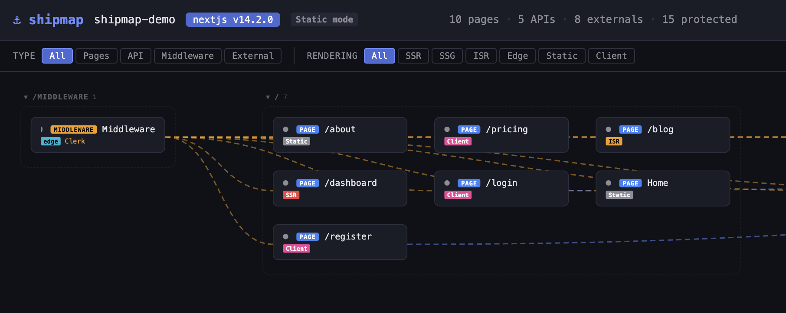
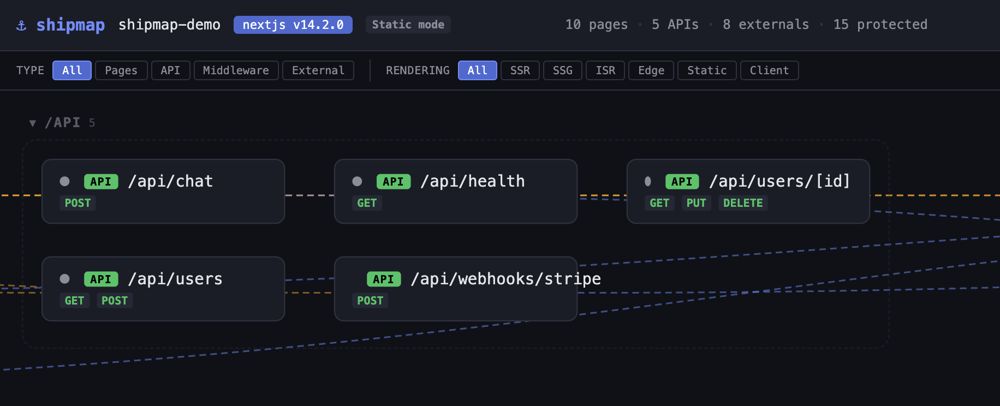
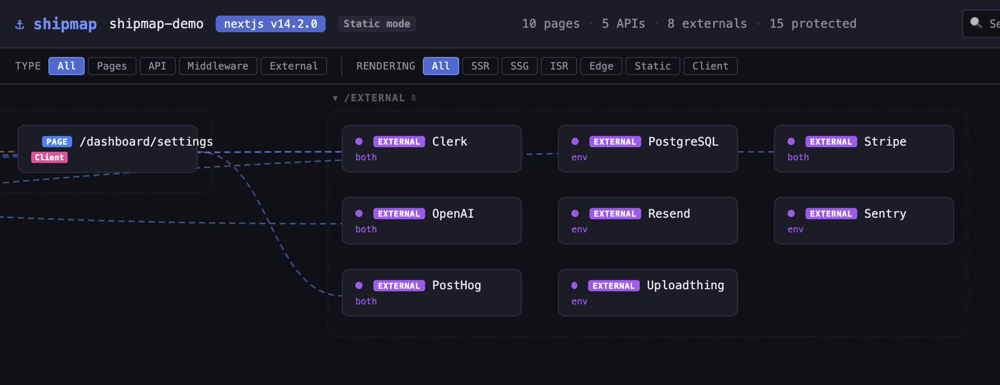

# 🧭 shipmap

**Map it before you ship it. Course correct after deploy.**



Auto-discover routes, APIs, middleware, and external services in your web project, then generate an interactive HTML topology map.

```bash
npm install --save-dev shipmap
```

## What it does

shipmap scans your project and produces a self-contained HTML report showing:

- **Page routes** with rendering strategy detection (SSR, SSG, ISR, Edge, Static, Client)
- **API routes** with HTTP method detection from exports (`GET`, `POST`, etc.)
- **Middleware** including `matcher` patterns, auth provider detection, and redirect targets
- **External services** detected from env var prefixes and import patterns (Stripe, Supabase, Firebase, AWS, OpenAI, Clerk, Prisma, and more)
- **Connectors** showing relationships between middleware coverage, route-to-external dependencies



The report is a single `.html` file with zero external dependencies. Open it in any browser.



## Framework support

| Framework                        | Status       | Routes | API Routes          | Middleware  | Externals |
| -------------------------------- | ------------ | ------ | ------------------- | ----------- | --------- |
| **Next.js** (App + Pages Router) | Full support | Yes    | Yes                 | Yes         | Yes       |
| **Remix**                        | Beta         | Yes    | Yes (loader/action) | ✗           | Yes       |
| **SvelteKit**                    | Beta         | Yes    | Yes (+server)       | Yes (hooks) | Yes       |
| **Astro**                        | Beta         | Yes    | Yes (API routes)    | Yes         | Yes       |
| **Nuxt**                         | Beta         | Yes    | Yes (server/api)    | Yes         | Yes       |
| **Vite + React**                 | Beta         | Yes    | Yes (fetch detect)  | ✗           | Yes       |
| **React Router SPA**             | Basic        | Yes    | ✗                   | ✗           | Yes       |
| **Other**                        | Basic        | Yes    | Yes                 | ✗           | Yes       |

- **Full support**: production-tested, all features working
- **Beta**: functional discovery with route normalization; edge cases may exist
- **Basic**: limited discovery (externals, simple route patterns)

Framework is auto-detected from `package.json` dependencies. No configuration needed.

## Install

```bash
npm install --save-dev shipmap
```

Or run directly without installing:

```bash
npx shipmap
```

## Try it

A sample Next.js project is included in the [`demo/`](demo/) folder (i GitHUb repo; not npm package). Run shipmap against it to see a full topology report without setting up your own project:

```bash
node bin/shipmap.js demo --verbose
```

## Usage

Add a script to your `package.json`:

```json
{
  "scripts": {
    "shipmap": "shipmap"
  }
}
```

Then run:

```bash
# Scan current directory, output shipmap-report.html
npm run shipmap

# Scan a specific project
npm run shipmap -- ./my-project

# Custom output path
npm run shipmap -- -o topology.html

# JSON output instead of HTML
npm run shipmap -- --json

# Don't auto-open in browser
npm run shipmap -- --no-open

# Quiet mode (errors only)
npm run shipmap -- -q

# Verbose discovery details
npm run shipmap -- --verbose

# Compare to previous run
npm run shipmap -- --diff

# Output as Markdown table
npm run shipmap -- --markdown
```

### Probe mode

Test discovered routes against a running server:

```bash
# Probe routes against localhost:3000
npm run shipmap -- --probe

# Probe against a custom URL
npm run shipmap -- --probe --probe-url https://preview.example.com
```

### CI mode

Use shipmap in continuous integration to catch topology regressions:

```bash
# Exit non-zero if errors found
npm run shipmap -- --ci

# Fail on specific conditions
npm run shipmap -- --ci --ci-fail-on errors,slow,unprotected

# CI + diff + JSON output
npm run shipmap -- --ci --diff --json -o report.json
```

Failure rules for `--ci-fail-on`:

| Rule             | Triggers when                                       |
| ---------------- | --------------------------------------------------- |
| `errors`         | Any route returns HTTP error (probe mode)           |
| `slow`           | Any route exceeds timeout threshold (probe mode)    |
| `unprotected`    | Routes lack middleware coverage                     |
| `unreachable`    | External service hosts are unreachable (probe mode) |
| `new-unreviewed` | New routes added since last run (with `--diff`)     |

Exit codes: `0` = pass, `1` = failures found, `2` = execution error.

### GitHub Actions

shipmap scans source files directly, so it does not depend on a build step. Add it anywhere in your workflow:

```yaml
# Static check (no running server needed)
- name: Topology scan
  run: npx shipmap --ci --diff --json > shipmap-report.json

# Optional: with probe against preview deployment
# - name: Topology probe
#   run: npx shipmap --ci --probe --probe-url ${{ env.PREVIEW_URL }}

- name: Upload topology report
if: always()
uses: actions/upload-artifact@v4
with:
    name: shipmap-report
    path: shipmap-report.html

# Optional: Comment on PR with topology changes
- name: Comment topology diff
if: always()
run: |
    npx shipmap --diff --markdown > /tmp/topology-diff.md
    gh pr comment ${{ github.event.pull_request.number }} --body-file /tmp/topology-diff.md
```

## Configuration (optional)

shipmap works out of the box with zero configuration. To customize behavior, create a `shipmap.config.js` in your project root:

```javascript
export default {
  probe: {
    baseUrl: "http://localhost:3000",
    timeout: 10000,
    concurrency: 5,
    headers: { Authorization: "Bearer ..." },
    exclude: ["/health", "/internal/*"],
  },

  discovery: {
    exclude: ["**/test/**", "**/storybook/**"],
    include: ["src/pages/**", "app/**"],
  },

  externals: [
    { name: "Plaid", envPrefixes: ["PLAID_"], importPatterns: ["plaid"] },
  ],

  groups: {
    admin: "/admin/*",
    auth: ["/login", "/register", "/forgot-password"],
  },

  ci: {
    failOn: ["errors", "unprotected"],
    slowThreshold: 5000,
    allowUnprotected: ["/login", "/register", "/api/health"],
  },
};
```

## Interactive report

The HTML report features a dark canvas visualization:

- **Pan**: drag the canvas background
- **Zoom**: scroll wheel
- **Drag nodes**: reposition any node
- **Click a node**: opens detail panel with file path, rendering strategy, methods, connections
- **F**: fit all nodes to view
- **Escape**: close detail panel
- **+/-**: zoom in/out

Nodes are color-coded by type:

| Type       | Color  |
| ---------- | ------ |
| Page       | Blue   |
| API        | Green  |
| Middleware | Amber  |
| External   | Purple |

Rendering strategies show as badges: SSR (red), SSG (green), ISR (amber), Edge (cyan), Static (grey), Client (pink).

## What it detects

### Rendering strategies (Next.js)

| Signal                      | Strategy |
| --------------------------- | -------- |
| `'use client'`              | Client   |
| `runtime = 'edge'`          | Edge     |
| `dynamic = 'force-dynamic'` | SSR      |
| `dynamic = 'force-static'`  | SSG      |
| `revalidate = N`            | ISR      |
| `generateStaticParams`      | SSG      |
| `getServerSideProps`        | SSR      |
| `getStaticProps`            | SSG      |
| `cookies()` / `headers()`   | SSR      |
| `searchParams`              | SSR      |
| Default                     | Static   |

### External services

Detected from all `.env*` files and package imports. 50+ built-in services including:

- **Payments**: Stripe, PayPal, Square, Lemon Squeezy
- **Auth**: Clerk, NextAuth, Auth0, Lucia, Kinde
- **Databases**: Supabase, Firebase, Prisma, Drizzle, MongoDB, PlanetScale, Turso, Neon, Convex, FaunaDB, Redis
- **AI**: OpenAI, Anthropic, Replicate, Cohere, HuggingFace, Groq, Mistral, Pinecone
- **Email**: Resend, SendGrid, Mailgun, Postmark
- **Messaging**: Twilio, Pusher, Ably
- **Cloud**: AWS, Cloudinary, Uploadthing, Vercel
- **Monitoring**: Sentry, Datadog, LogRocket, PostHog
- **Search**: Algolia, Meilisearch
- **CMS**: Sanity, Contentful, Strapi
- **APIs**: GitHub, Slack, Discord

`DATABASE_URL` is parsed by protocol: `postgresql://` → PostgreSQL, `mysql://` → MySQL, `mongodb://` → MongoDB.

Env var **values are never included** in the report. Only service names.

To add custom or missing services, use the `externals` config:

```javascript
// shipmap.config.js
export default {
  externals: [
    { name: "Plaid", envPrefixes: ["PLAID_"], importPatterns: ["plaid"] },
  ],
};
```

### Middleware

- `matcher` pattern extraction from `export const config`
- Auth provider detection (NextAuth, Clerk, Supabase, Kinde, custom)
- Redirect target detection
- Route coverage connectors

## Programmatic API

The CLI is built on top of a fully exported TypeScript API. Every function the CLI uses is available to your own scripts, so you can build custom dashboards, enforce project-specific rules in CI, generate reports in any format, or integrate topology data into other tools.

### `discover(directory, options?)`

The main entry point. Scans a project directory and returns a `TopologyReport` with all discovered pages, API routes, middleware, external services, and the connections between them.

```typescript
import { discover } from "shipmap";

const report = await discover("./my-project", {
  // Register services that aren't in the built-in list
  customExternals: [
    { name: "Plaid", envPrefixes: ["PLAID_"], importPatterns: ["plaid"] },
  ],
});
```

The returned `TopologyReport` contains everything shipmap knows about your project:

```typescript
report.meta; // framework, version, project name, generation timestamp
report.nodes; // every page, API route, middleware, and external service
report.connectors; // relationships: middleware coverage, external dependencies
report.groups; // logical groupings (pages, api, external, etc.)
report.summary; // totals and rendering strategy breakdown
```

Each node in `report.nodes` is typed by its role:

| Node type                 | Key fields                                                            |
| ------------------------- | --------------------------------------------------------------------- |
| `RouteNode` (page or api) | `path`, `filePath`, `methods`, `rendering`, `isProtected`, `probe`    |
| `MiddlewareNode`          | `filePath`, `matcherPatterns`, `authProvider`, `redirectTarget`       |
| `ExternalNode`            | `name`, `detectedFrom` (env, import, or both), `referencedBy`, `host` |

### `generateReport(report, diff?)`

Turns a `TopologyReport` into a self-contained HTML file with the interactive canvas visualization. Optionally pass a `DiffResult` to highlight added, removed, and changed nodes.

```typescript
import { discover, generateReport, compareTopology } from "shipmap";
import { writeFile, readFile } from "node:fs/promises";

const current = await discover("./my-project");
const previous = JSON.parse(await readFile("./last-report.json", "utf-8"));
const diff = compareTopology(current, previous);

// HTML report with changes highlighted
const html = generateReport(current, diff);
await writeFile("topology.html", html);
```

### Diffing and change detection

Compare any two reports to get a structured diff. This is what powers `--diff` on the CLI, but you can use it to build your own change notifications, PR comments, or audit logs.

```typescript
import { discover, compareTopology, generateMarkdown } from "shipmap";

const current = await discover("./my-project");
const previous = /* load from file, database, S3, etc. */;
const diff = compareTopology(current, previous);

diff.added;    // new routes, services, or middleware since last run
diff.removed;  // routes or services that no longer exist
diff.changed;  // nodes with altered rendering strategy, methods, etc.

// Render as a Markdown table (useful for PR comments)
const md = generateMarkdown(current);
```

### Probing a live server

Probe functions let you test discovered routes against a running server and check external service reachability. Combine with `discover()` to build health checks or deployment verification scripts.

```typescript
import { discover, probeRoutes, probeExternals, detectAuth } from "shipmap";

const report = await discover("./my-project");

// Auto-detect auth headers (Clerk, NextAuth, etc.)
const auth = await detectAuth("./my-project");

// Probe all page and API routes
const routes = report.nodes.filter(
  (n) => n.type === "page" || n.type === "api",
);
const probed = await probeRoutes(routes, {
  baseUrl: "https://staging.example.com",
  timeout: 10000,
  concurrency: 5,
  headers: auth?.headers ?? {},
});

// Check which external services are reachable
const externals = report.nodes.filter((n) => n.type === "external");
const probedExternals = await probeExternals(externals, { timeout: 10000 });

// Build your own alerting logic
const broken = probed.filter((r) => r.probe?.status === "error");
const unreachable = probedExternals.filter((e) => !e.probe?.reachable);
```

### Building custom CI rules

The CI runner is also exported, so you can evaluate pass/fail rules programmatically and integrate the results into any workflow.

```typescript
import { discover, compareTopology } from "shipmap";
import { evaluateCi } from "shipmap";

const report = await discover("./my-project");
const diff = compareTopology(report, previousReport);

const result = evaluateCi(report, ["errors", "unprotected", "new-unreviewed"], {
  slowThreshold: 5000,
  diffResult: diff,
});

if (!result.passed) {
  for (const failure of result.failures) {
    console.error(`[${failure.rule}] ${failure.message}`);
  }
  process.exit(result.exitCode); // 1 = failures found, 2 = execution error
}
```

### All exports

| Export                               | Description                                            |
| ------------------------------------ | ------------------------------------------------------ |
| `discover(dir, options?)`            | Scans a project and returns a `TopologyReport`         |
| `generateReport(report, diff?)`      | Renders an interactive HTML report                     |
| `detectFramework(dir)`               | Returns `{ type, version }` for the detected framework |
| `loadConfig(dir)`                    | Loads and validates `shipmap.config.js`                |
| `compareTopology(current, previous)` | Diffs two reports, returns added/removed/changed nodes |
| `generateMarkdown(report)`           | Renders topology as a Markdown table                   |
| `probeRoutes(nodes, options)`        | HTTP-probes route nodes against a running server       |
| `probeExternals(nodes, options)`     | Checks reachability of external service hosts          |
| `detectAuth(dir)`                    | Auto-detects auth provider and generates probe headers |
| `archiveReport(dir, report)`         | Saves a timestamped snapshot for future diffs          |
| `readReportFromPath(path)`           | Reads a previously saved JSON report                   |

### TypeScript types

All types are exported for use in custom integrations:

```typescript
import type {
  TopologyReport, // the full report object
  TopologyNode, // union of all node types
  RouteNode, // page or API route
  MiddlewareNode, // middleware with matcher patterns
  ExternalNode, // detected external service
  Connector, // relationship between two nodes
  RenderingStrategy, // SSR, SSG, ISR, Edge, Static, Client
  FrameworkType, // nextjs, remix, sveltekit, astro, nuxt, etc.
} from "shipmap";
```

## Requirements

- **Node.js 18+** (uses `fetch`, `crypto.randomUUID`, and other Node 18 APIs)
- **A web project with `package.json`** in the root (used for framework detection and project naming)
- **A supported framework** (see [Framework support](#framework-support) above) for full route and middleware discovery. Projects without a recognized framework still get basic route and external service detection.
- **File-based routing conventions** must be in place (e.g., `app/` or `pages/` for Next.js, `src/routes/` for SvelteKit). shipmap scans source files directly and does not require a build step.
- **Probe mode** (`--probe`) requires a running dev or preview server at the target URL
- **`.env` files** are optional but recommended. shipmap reads them to detect external service integrations. Env var values are never included in reports.

## License

MIT
